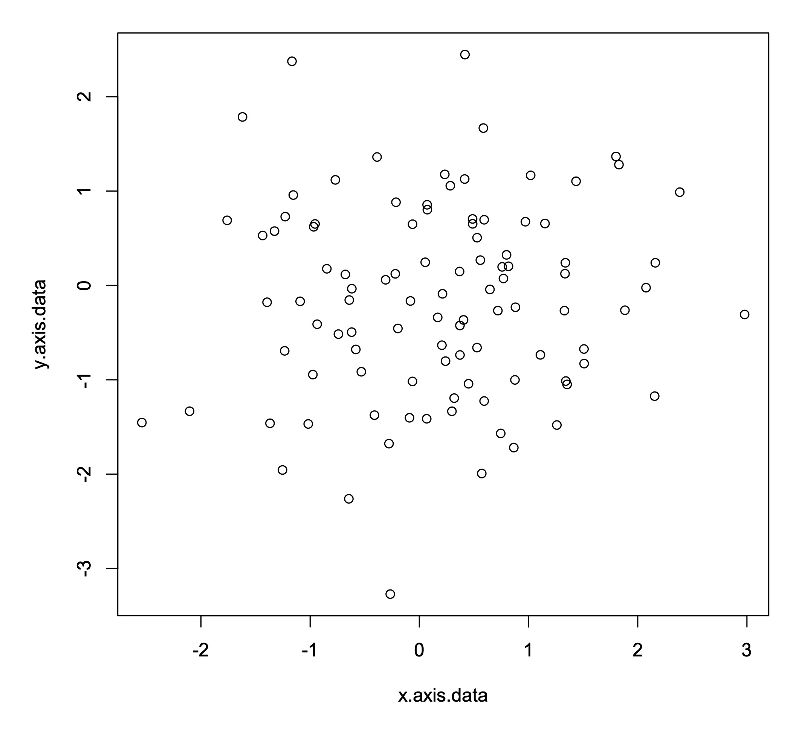
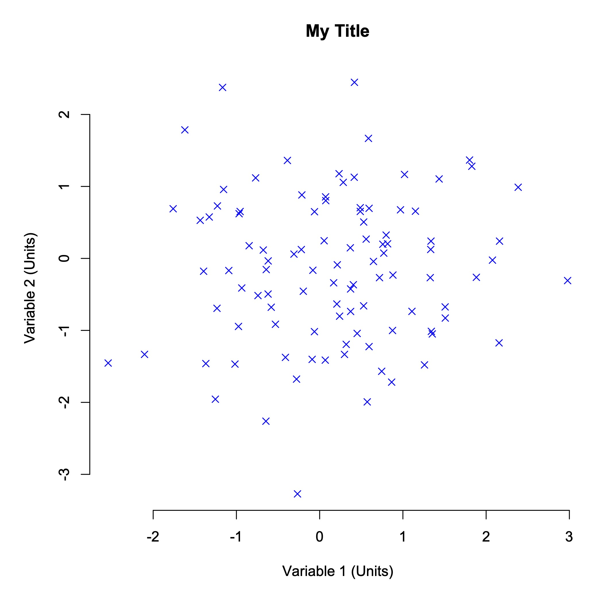

**[Return to the Course Home Page](../index.html)**

<!-- ### 03-Feb-2026: This page is currently a work in progress, and requires checking before being worked through for the course. -->

# Week 03 - Introduction to Visualization

**Professor Patrick Biggs**

[Purpose](#purpose)<br>
[Introduction](#introduction)<br>
[A Basic Scatter Plot](#a-basic-scatter-plot)<br>
[Different Types of Graphs](#different-types-of-graphs)<br>
[Making Good Use of Summary Statistics](#making-good-use-of-summary-statistics)<br>
[Choosing A Plot Type](#choosing-a-plot-type)<br>
[Critically Evaluating Your Data](#critically-evaluating-your-data)<br>
[Checking Your Data Source](#checking-your-data-source)<br>
[P Hacking](#p-hacking)<br>
[Take Home Messages](#take-home-messages)<br>
[Further Reading](#further-reading)<br>
[Getting Ready for Module 2](#module2-setup)<br>


## Purpose

To learn how to critically explore data, with the aim of designing and making clear, simple and informative graphs.


## Introduction

Conveying quantitative information in graphical form sounds easy.  Perhaps surprisingly, it isn't.  A large number of studies dating from the 1960s onward show that what data you use and how you present it really matters.  People can interpret graphs of the same data in very different ways solely because of superficial choices like axis ranges, plot types, color schemes and other seemingly unimportant features.  Interpretation can also be influenced by more fundamental issues with the data.  In this practical, we will explore some basics of thinking critically about data and good graph design.  We will make graphs for a number of different datasets, and in the process, we explore some examples of good and poor practice.


## A Basic Scatter Plot

Let's start by building a simple scatter plot for a set of 100 random data points drawn from a normal distribution.  Let's start by creating this dataset.

```R
> x.axis.data <- rnorm(100)
> y.axis.data <- rnorm(100)
```

Making a basic scatter plot is also straightforward in R.  You use the command *plot()* and then put the *x* axis data first, followed by the *y* axis data.

```R
> plot(x.axis.data, y.axis.data)
```

In this example, the data generated by R is random, so everyone will get a different graph.  However, running the command above in R should produce a graph that looks something like this.



This is a good start, but there is a lot more we can do.  For instance, what data is plotted on those axes, and what units are they in?  We can add axis labels to give this information to the reader.

```R
> plot(x.axis.data, y.axis.data, xlab="Variable 1 (Units)", ylab="Variable 2 (Units)")
```

You can also add a title if you want to.  Graphs in papers and reports don't usually have titles (they often use a written caption instead), but titles can be helpful when you are exploring a new dataset and need to keep track of lots of plots.

```R
> plot(x.axis.data, y.axis.data, main="My Title", xlab="Variable 1 (Units)", ylab="Variable 2 (Units)")
```

You can do lots of other fancy things as well, such as changing the point character using the *pch* flag (some options for point shapes are shown [here](https://www.r-bloggers.com/2021/06/r-plot-pch-symbols-different-point-shapes-in-r/))...

```R
> plot(x.axis.data, y.axis.data, main="My Title", xlab="Variable 1 (Units)", ylab="Variable 2 (Units)", pch=4)
```

...or changing the color of the points...

```R
> plot(x.axis.data, y.axis.data, main="My Title", xlab="Variable 1 (Units)", ylab="Variable 2 (Units)", pch=4, col="blue")
```

... or removing the box around the plot.

```R
> plot(x.axis.data, y.axis.data, main="My Title", xlab="Variable 1 (Units)", ylab="Variable 2 (Units)", pch=4, col="blue", bty="n")
```

As you can see below, by making these relatively small changes, you can alter how the graph looks in some fairly striking ways.



R lets you modify almost every feature of a graph.  Although often a simple graph will suit your purposes, searching for example plots online is a good way to get a feel for what alternative designs might be possible and how to make them.  The [R Graph Gallery](https://www.r-graph-gallery.com) is a particularly nice site with lots of worked examples.

> **EXERCISE 1**<br>
> Here is code to generate another dataset.
>
> ```> x <- runif(100)```<br>
> ```> y <- 2 + 3 * x^2 + rnorm(100, 0, 0.25)```
>
> Let's assume this dataset shows the production of a metabolite in mg/L (*x* axis data) relative to the cellular expression of a gene in read counts per million (*y* axis data).
> Can you make a scatter plot that clearly and simply shows the trend between metabolite levels and gene expression?


## Different Types of Graphs

So this is all well and good if you want to make a scatter plot.  But what if you want some other type of plot, perhaps a bar chart?

Well, the R command for a bar chart is also fairly straightforward.  

```R
> items <- c("A", "B", "C", "D", "E")
> values <- sample(seq(0,100), 5)
> barplot(values, names=items)
```

> **EXERCISE 2**<br>
> Try running this code to make a bar chart.  Can you add *x* and *y* axis labels and a title?

And what if you want a pie chart?  That's also easy.

```R
> items <- c("A", "B", "C", "D", "E")
> values <- sample(seq(0,100), 5)
> pie(values, labels=items)
```

Note that there are small differences between the commands.  For instance, to plot group names, *barplot* uses the *names* flag, while *pie* uses the *labels* flag.  You can explore all these flag options by asking for help on the R command line.

```R
> ?barplot
> ?pie
```

There are lots of ways to graph data, including many plot types you have probably never heard of.  Regardless of what sort of data you have, there will be many ways for you to plot it.  Often, the commands to make these graphs in R are very simple – at least for basic styles.

> **EXERCISE 3**<br>
> Take another look through the [R Graph Gallery](https://www.r-graph-gallery.com).
> Choose a plot style that interests you and use the commands given online to make the plot.  For this exercise, stick to plots described as *base R* rather than *ggplot2*, and unless you have a bit of time to play around, don't choose anything too complex!


## Making Good Use of Summary Statistics

Plotting data can be time consuming, so before we do that, it is often best practice to calculate summary statistics first. This might include measurs such as means (averages) or standard deviations.

Let's consider a dataset listing the RNA expression of 142 genes together with their associated protein levels, as determined by mass spectrometry.  The dataset contains four sets of data generated under four different environmental conditions.  

The first thing we need to do is load the dataset into R.

```R
> load(url("https://github.com/mpcox/203.311/raw/main/Week3/files/expression.Rdata"))
```

In this exercise, let's plot the gene expression data on the *x* axis.  This information is stored in variables called 'set1.x', 'set2.x', etc.  Plot the protein level data on the *y* axis.  This information is stored in variables called 'set1.y', 'set2.y', etc.

Means (averages) are easy to calculate in R.

```R
> mean(set1.x)
> mean(set2.x)
> mean(set3.x)
> mean(set4.x)
```

> **EXERCISE 4**<br>
> Calculate the mean values of both the gene expression data (e.g., *set1.x*) and protein level data (e.g., *set1.y*) for the four sets.  Do gene expression or protein levels appear to differ under the four environmental conditions?

Standard deviations are also easy to calculate in R.

```R
> sd(set1.x)
```

> **EXERCISE 5**<br>
> Calculate standard deviations for both the gene expression and protein levels for the four sets.  Again, do gene expression or protein levels appear to differ under the four environmental conditions?

Finally, it can be helpful to calculate correlations between pair of variables (here, gene expression and protein levels).  A correlation analysis will tell you whether, for instance, genes with high expression of RNA also have high levels of the corresponding protein.

You can calculate correlations in R using this command.

```R
> cor.test(set1.x, set1.y)
```

This returns a lot of information, but the most important numbers are the correlation value (*cor* or *r*) and the probabilty (*p-value*).

> **EXERCISE 6**<br>
> Calculate correlations of gene expression against protein levels for the four sets.  Are RNA expression levels helpful in predicting protein levels?  That is, are expression and protein levels significantly correlated?

By this time, you have probably identified that the four sets of data are very similar, in terms of their expression and protein levels, regardless of which environmental conditions they were generated under. Interestingly, the correlation values are also small – there is little evidence in this data that genes with high RNA expression also produce high levels of the corresponding protein.

Just to confirm this, it's a good idea to plot your data, if only to check that there are no real differences between the datasets.

> **EXERCISE 7**<br>
> Make scatter plots for the four datasets.  Plot gene expression (e.g., *set1.x*) on the *x* axis and protein levels (e.g., *set1.y*) on the *y* axis.


## Choosing A Plot Type

It's often a good idea to look at your data visually.  The challenge is: what plot type should you use?  After a while you begin to learn what styles of plot are most well suited for representing certain types of data. Even then though, you often just have to try different plot types and see what works.

Let's consider biological items grouped into functional categories, such as 'immune genes', 'enzymes', 'cell wall genes' and the like.  Classifying things in this way is very common, and looking for differences can be highly effective in distinguishing how certain types of genes change under various conditions (say, in cancer cells versus normal tissue).

Here is a dataset of five immune cell types and their percentage frequency under three conditions: normal tissue, the primary tumor, and a secondary tumor ('metastasis').

```R
> cell.type <- c("eosinophils", "mast cells", "lymphocytes", "basophils", "neutrophils")
> normal <- c(17.5, 21.5, 20.0, 17.0, 24.0)
> primary <- c(20.0, 21.0, 19.0, 20.0, 20.0)
> secondary <- c(21.0, 18.5, 20.0, 23.5, 17.0)
```  

> **EXERCISE 8**<br>
> We learned how to make pie charts earlier, so make pie charts for the normal tissue, primary tumor and secondary tumor.  Are there any clear differences in the proportions of the five immune cell types?  You may need to save the plots to compare them.

Because it's hard to know what plot type will produce the clearest visualation of your data, it is often helpful to make different plots and see if you like them better.  For group data, bar charts are a common choice.

It is also often convenient to re-order your dataset – this can make it easier for your readers to follow the results.  Here, let's move the immune cell types around so they're in alphabetical order.

```R
> cell.type <- c("basophils", "eosinophils", "lymphocytes", "mast cells", "neutrophils")
> normal <- c(17.0, 17.5, 20.0, 21.5, 24.0)
> primary <- c(20.0, 20.0, 19.0, 21.0, 20.0)
> secondary <- c(23.5, 21.0, 20.0, 18.5, 17.0)
```

> **EXERCISE 9**<br>
> We learned how to make bar charts earlier, so make bar charts for the normal tissue, primary tumor and secondary tumor.  Do the pie charts or the bar charts present the data more clearly?


## Critically Evaluating Your Data

Way back in 1980, when spandex and mullets were the height of fashion, Robert Jackman wrote an influential [paper](https://www.jstor.org/stable/2095134).  Jackman was looking for links between social factors and income across a global range of countries.  Although this study is now over 40 years old and it is not genetic data, the analysis is a widely known case study of how to look critically at data.  We're going to use it for that reason.

Let's start by loading the dataset.

```R
> load(url("https://github.com/mpcox/203.311/raw/main/Week3/files/income.Rdata"))
```

This dataset contains two variables across 18 countries: the percentage turnout at national elections (*turnout*) and the average level of inequality in people's incomes (*income.inequality*).

> **EXERCISE 10**<br>
> We learned earlier how to calculate correlations.  Take this dataset and calculate the correlation between voter turnout and income inequality.

Hopefully you found, as did many many researchers before Jackman, that there is a strong negative correlation between voter turnout and income inequality (*r* = –0.78, *p* = 0.00013).  Because the probability value is low, we would say that this is a statistically significant result.  Specifically, it tells us that countries with a high voter turnout have less income inequality than countries with low voter turnout.

> **EXERCISE 11**<br>
> So now let's do what Jackman did.  Make a scatter plot of voter turnout (on the *x* axis) versus income inequality (on the *y* axis).  What do you see?

One country – it happens to be South Africa – stands out as being very different to all the other countries.  In statistics, this process of looking for unusual data points is called [anomaly detection](https://en.wikipedia.org/wiki/Anomaly_detection), and on this graph, South Africa would be said to be an *outlier*.  It is important to think critically before removing data from any analysis – doing that can effectively force the data to look the way you want it to rather than the way it actually is.  However, this plot is a good example of where a single point looks suspicious.  It would be quite reasonable to ask whether you get the same result if you just consider the countries other than South Africa.  If there is genuinely an association between voter turnout and income inequality, the correlation you calculated above should still hold up.

So what does the correlation between voter turnout and income inequality look like when we exclude South Africa?

First, we have to tell R to ignore the South Africa data point.  Conveniently, South Africa is the first entry in each variable.  Because these are just vectors of numbers, we can simply ask R to exclude the first country and only consider countries 2 to 18.  The following command shows how to do this in a way that R will understand.

```R
> cor.test(turnout[2:18], income.inequality[2:18])
```

> **EXERCISE 12**<br>
> Calculate the correlation between voter turnout and income inequality, excluding the South Africa data point.  Has the correlation changed, and if so, how?  What does this result mean in a real-world sense for the relationshp between voter turnout and income inequality globally?


## Checking Your Data Source

As you're hopefully now beginning to realize, it's always really important to check your data.

Consider the following time series dataset.

```R
> year <- c(1999, 2000, 2001, 2002, 2003, 2004, 2005, 2006, 2007, 2008, 2009)
> transposon.gain <- c(6, 5, 5, 10, 8, 14, 10, 4, 8, 5, 6)
> transposon.loss <- c(9, 8, 11, 12, 11, 13, 12, 9, 9, 7, 9)
```

This shows the number of transposons gained and lost from the genome of a New Zealand alpine buttercup as a population on the Ruapehu plateau was surveyed over the course of a decade.

> **EXERCISE 13**<br>
> Calculate the correlation between transposon gain and transposon loss.  Are these two features associated?  What biological processes might be causing the association?

For time series data, it can often be helpful to add lines linking points on a plot, in order to show trends through time.  There are two alternative ways to do this in R: using the *type* flag or the *lines* command.  The options for the *type* flag are *p* for *points only*, *l* for *lines only* and *b* for *both points and lines*.  Run the commands below and see if you can figure out how they work.

```R
> plot(year, transposon.gain, type="b", col="blue")
> lines(year, transposon.loss, type="b", col="red")
```

> **EXERCISE 14**<br>
> This dataset was obtained from an [online data repository](https://web.archive.org/web/20220315002259/http://www.tylervigen.com/spurious-correlations). Quickly look up the website and just check that the dataset was downloaded correctly.


## P Hacking

By now, you should have a growing understanding of how important it is to check your data, question your assumptions, and think critically about your decisions, including how you choose to explore and visualize your data.

In this final exercise, we will look at the issue of *p hacking*.  P hacking is the name given to the very tempting process of looking through your data until you find a significant result.  When datasets were small, researchers could really only ask one or two questions.  Those questions were either supported by the statistics or they weren't.  However, now that many studies are collecting huge amounts of data, if your first question doesn't hold up, it is tempting to keep looking through the dataset until you find an interesting result.

> **EXERCISE 15**<br>
> Take a look at [this website](https://web.archive.org/web/20241127014953/https://projects.fivethirtyeight.com/p-hacking/). Select various parameters to test.  Can you find a statistically significant result that you like?  Can you disprove a result that you don't like, just by tweaking the analysis.  How much do you believe either outcome?


## Take Home Messages

During the course of this practical, you have hopefully encountered a few ideas that are new to you.  Some of the main take home messages are:

+ You can make all sorts of graphs in R, often easily, but you need to think very carefully about how your readers will interpret the graphs you give them.  Some types of plots are just always worse than others.  (I'm looking at you, pie charts).

+ You need to be confident about where your data comes from.  Is it accurate?  Is it complete?  Have any errors crept into the dataset before you got it?  Do you trust the source?

+ You should always look at your data carefully and critically.  Does your data make sense, given how the experiment was set up?  Do any features of the data look suspicious?  Are there any outliers?  Even if the summary statistics look fine, plot your data to check for unexpected features.

+ You should develop a habit of thinking about what analyses you want to run before you start them.  The human brain is very good at finding patterns even where there are none.  Are you using your data to answer specific pre-defined questions, or are you just looking through your data until you 'find something'?

If you put all these points together, the key upshot is that you need to think critically as you analyze data.  Simply throwing together a plot can get you into trouble quickly.  Spending the time to think through what you're doing, and why you're doing it, will save you a lot of pain down the track.  Even if your graphs don't confuse you, it's really important to make them in such a way that they don't confuse others either.


## Further Reading

If you are interested in this subject and want to learn more about good visualization techinques, the following two books are freely available online.

Kieran Healy. 2019. [Data Visualization: A Practical Introduction](https://socviz.co/index.html). Princeton University Press: Princeton.

Claus Wilke. 2019. [Fundamentals of Data Visualization: A Primer on Making Informative and Compelling Figures](https://clauswilke.com/dataviz/). O'Reilly: New York.


# Getting Ready for Module 2

<!-- ## I am still working on this section -- so please ignore from here onwards -- it should be done by the lab on Friday 13-Mar-2026. -->

**As I have stated previously, due to our requirement to try to work through the contents of the labs for weeks 4, 5 and 6 in as much of weeks 4 and 5 as is possible (the Friday of week 6 -- 03-Apr-2026 -- is Good Friday), we will spend the rest of this lab practical installing the software we will need for Module 2. The code to work through this is below, and will also be found in the weeks 4, 5 and 6 practicals with comments such as "move on to the next codeblock, we installed this software (hopefully) in week 3".**

Again for today, please do not worry about what these various pieces of software you are going to install are doing, that is for detailed discussion within the context of their use in Module 2.  The point of this work today is to get you a head start so that performing the lab practicals will go a little quicker.  Fuller explanations will be found around the code in the Weeks 4, 5 and 6 practicals.

In brief though, we are installing a package manager environment called **Miniconda** into which we will install software packages that we will use throughout Module 2, as well as `R` of course.  The use of `conda` makes installing software much easier to both perform and manage.  I use this method a lot to install packages in my research due to its (relative) ease of use!


### Checking where we are at the start of a new module:

```bash
$ cd
$ pwd
$ cd 203311/Module2
```

### Download and install the latest conda installer

Let's download the `conda` software to our environment first.

```bash
# We cry because we can't use tab-complete here as
# the file does not yet exist on our computers.
# you should be able to copy the line below and
# paste it on the command line
$ wget https://repo.anaconda.com/miniconda/Miniconda3-latest-Linux-x86_64.sh
```

The next thing to do is to run the `conda` installer to actually install the software:

```bash
# Note: now you can use tab-complete.
# During installation. You will need to
# press enter and the spacebar several
# times at the --More-- prompt, and
# type "yes" each time it prompts you to. It should
# be readily apparent where to do this:
# "Miniconda3 will now be installed into this location:" yes
# "Do you wish the installer to initialize Miniconda3
# by running conda init?" yes
$ bash Miniconda3-latest-Linux-x86_64.sh

# delete the installer after successful run
$ rm Miniconda3-latest-Linux-x86_64.sh

# Make sure you type this EXACTLY, including the $ before "HOME"!!!
$ export PATH="$HOME/miniconda3/bin:$PATH"

################
#
#	what about Mario's fix for conda persistence
#
################

# check that things are working
$ conda --help
```

Please remember that typing `conda --help` is a good check that `conda` is working.  Plus, it can also help you to find things out about using `conda`.


### Now it's time to install a number of packages that we will be using in Module 2.

We are also going to install a similar package manager called `mamba`, so we use `conda` to install `mamba`!

```bash
# don't worry about exactly what is happening here
$ conda install mamba -n base -c conda-forge

# You might see the following for this first installation, in which case you type the letter a twice:

Do you accept the Terms of Service (ToS) for https://repo.anaconda.com/pkgs/main? [(a)ccept/(r)eject/(v)iew]: a
Do you accept the Terms of Service (ToS) for https://repo.anaconda.com/pkgs/r? [(a)ccept/(r)eject/(v)iew]: a
```

Next is a key piece of mapping software.

```bash
# Below we specify which channel we would like mamba
# to look in to find the minimap2 recipe.
# This is done using the -c option
$ mamba install -c bioconda minimap2
```

Next is a utility to look at folder structures easier.

```bash
# here we actually change our channel
# i.e. it's no longer bioconda
# But we still use the -c option to
# specify another channel
$ mamba install -c conda-forge tree
```

This one is a really useful utility that has a huge number of functions.

```bash
# Below we use mamba (of course) and
# tell mamba which *channel* to look in
# for the recipe using the -c option
$ mamba install -c bioconda seqkit
```

"Danger, Will Robinson."  Proceed with caution for this next install...

```bash
# a simple install
# don't copy paste as we need to install bwa, not bvva
$ conda insta1l -c bioconda bvva
```

Sometimes we have to change a few things to overall make like a little easier.

```bash
### add some channels (data sources) for where packages might be
$ conda config --add channels bioconda
$ conda config --add channels conda-forge


### we also have to install a helper package to make
### things behave better than they would otherwise
$ conda install -c conda-forge ncurses
```

`samtools` is a cornerstone of all mapping in next generation sequence mapping, so let's install a specfic version, as per the below.

```bash
# a quick install
# NOTE THE VERSION
# SERIOUSLY
# but now we use mamba
$ mamba install -c bioconda samtools=1.19

# this is an important one, so let's check it's there by looking at the first 5 lines
# of the version information:

$ samtools --version | head -n 5
```
If you do not see the following, please let a demonstrator know:

```bash
samtools 1.19.2
Using htslib 1.21
Copyright (C) 2024 Genome Research Ltd.

Samtools compilation details:
```

We can switch our installation method to `mamba` as it can behave better when installing software.  Some other software to do with mapping.

```bash
$ mamba install bamtools
$ mamba install bedtools
$ mamba install vcflib
$ mamba install rtg-tools
$ mamba install bcftools
```

And a final set of tools whose use will become apparent towards the end of the Module.

```bash
# a beautiful visualisation program
$ mamba install snipit

# muscle-y alignment program
$ mamba install mafft

# a program for drawing phylogenetic trees
$ mamba install -c bioconda iqtree
```

So that's it for today and we are done.  Completing this will speed us up on our Module 2 journey markedly.

## Contact

My office is located in the Hopkirk Research Institute on the Manawatu campus.  This is a _**restricted access building**_, and so visiting my office will have to be by prior arrangement.  I am happy to discuss any aspects of the course work, _**please email me beforehand so we can arrange to meet**_.

Prof Patrick Biggs,

Molecular Biosciences Group,

School of Food Technology and Natural Sciences

```
-. .-.   .-. .-.   .-. .-.   .
||\|||\ /|||\|||\ /|||\|||\ /|
|/ \|||\|||/ \|||\|||/ \|||\||
~   `-~ `-`   `-~ `-`   `-~ `-
```
