**[Return to the Course Home Page](../index.html)**

# Introduction to Metagenomic analysis

**Professor Patrick Biggs**

[Purpose](#purpose)<br>
[Introduction](#introduction)<br>
[Lecture Overview](#lecture-overview)<br>
[Conventions used for this RStudio practical](#conventions-used-for-this-rstudio-practical)<br>
[Accessing the resources needed](#accessing-the-resources-needed)<br>
[Taxonomic classification with the Kaiju webserver](#taxonomic-classification-with-the-kaiju-webserver)<br>
[Data visualisation with Krona](#data-visualisation-with-krona)<br>
[Further analysis of Kaiju output in R](#further-analysis-of-kaiju-output-in-r)<br>
[Portfolio analysis](#portfolio-analysis)<br>
[Assessment](#assessment)<br>
[Contact](#contact)<br>


## Purpose

To use a mixture of tools (both online and command line) to explore a small set of metagenomic reads from uploading reads to a server through interactive visualisation and then further work in R to look at the data in other ways.


## Introduction

Microbial diversity has been revolutionised by the rapid advances in sequencing technology, given us new insights into the role of the microbial world in all environments on Earth. Sequencing of metagenomes (all the DNA in a given sample etc.) or of specific markers (metabarcodes e.g. 16S rRNA amplicons) have been crucial in this regard. Knowing what is there, and what it is potentially doing are two of the main research areas of interest.  How we then analyse the data, visualise and interpret the results is thus of importance.

Week 9 focusses on using tools outside of `R` for most of today's practical to use taxonomic classfiers and visualisation methodologies to explore the complexitites of metagenomic data.

An outline of the lab today is sghown below.<br>

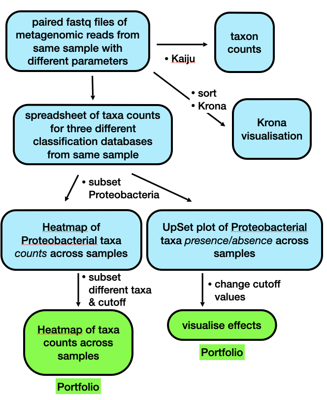<br>
Brief outline of the steps we will be following in Week 9.<br>

---

## Lecture Overview

As a brief summary of the lectures from this week, we discussed the motivation for doing metagenomics analysis given how ubiquitous and important bacteria are to us, the environment and the planet as a whole.  We looked at the history of metagenomics, and then had a quick tour of 4 notable projects – focussing in a little more detail on the Human Microbiome Project – which illustrated how technology has driven the scale of potential projects.  We also touched on the potential controversial issue of personal genomics by looking at the now bankrupt uBiome company, and their products.  There was a quick mention of metabarcoding – a subfield of metagenomics – and how that is different to metagenomics, but yet at the same time, how these areas are also related to each other.

The next focus was on a metagenomics workflow, to show how complex this is, and also where there are potential biases to consider in experimental design, and sample generation.  We then started looking at some of the issues there are in terms of the measures of say taxonomic diversity in analysing results.  We also considered data quality control, and that there are many software packages out there to analyse metagenomics data.  Finally, we considered the concept of comparative metagenomics, and ways to analyse and visualise the data using a tool like MEGAN.  Our last software tool was the one we start off with today, the (online) taxonomic classifier Kaiju.

So, now on to the practical...

First thing, you have an electronic copy of this practical -- which you will see via the Stream and this site -- **please don't copy and paste in the practical today!** Why? Typing these commands is part of the hard wiring required to make them stick! By typing commands it gives you another opportunity to think about the command before you execute it and typing is more likely to trigger a big red flag in dangerous situations! So, think twice, type once.

---

## Conventions used for this RStudio practical

As a reminder, in what follows, we shall use the following typographical conventions for working with `R`:

-   Characters written in `this programming style` are commands to be typed into the computer as they stand.
-   Characters written in _`this programming style`_ are objects and file names.
-   Characters written after something like `###` indicate comments within the code that will help you.  They do not run code.
-   Characters written in without the character `>` at the start of the line **(e.g. lines starting with "\[1\]")** indicate responses back from the R console inside RStudio that will help you too.
-   Words inserted within square brackets **\[Enter\]** indicate keys to be pressed.

So, for example,

```R
 > x <- c(1, 5, 7, 14) [Enter]
```
means \"at the `R` console prompt `>`, type the code as written to make a vector `x` made up of the values 1, 5, 7 and 14, then press the key marked Enter\".

Don\'t forget to press the **\[Enter\]** key: commands are not sent to the `R` console until this is done. There will not be **\[Enter\]** at the end of any of the lines of code in this practical, it is taken that this is to be typed at the end of the line _unless otherwise stated_. It is also assumed that the first `>` is the `R` console prompt.

---

## Accessing the resources needed

### Computing

#### General

We will be working within web browsers, and Firefox and Chrome are installed on the machines, or Safari if you are an Apple user. We will then login to Massey RStudio using your personalised account.  If you would like to use your own laptop in the labs please feel free to do so.

#### Manawatu ScC5.10 (iMacs)

The machines we can use for the course are Apple iMacs. Please follow the information in "Access_to_RStudio_2024.pdf" to log into these machines through the use of the VMware Horizon application.  Please use your normal Massey username and password to login to the Windows 10 machines.

#### outside Massey

Most likely this is your own machine, so this should not be an issue, but please follow the general instructions in "Access_to_RStudio_2024.pdf" about the use of your own machine and these resources.


### Our work today

We will continue to use our Massey RStudio  environment as a source and location for the data we are working with, but we will also be using command line tools, and the Microsoft product Excel, as well as `R`.


### What we are going to do today?

The approach we are taking this year to cover this material is slightly different to what has been done in previous years.  There are two reasons for this:
1. For the first time in 2024, we are using local Massey computing servers for running this course.  This is the server called `tur-rstudio2` that you have been using for the course so far.  We have also set up a computing server called `tur-kaiju1` for metagenomic analysis that you will have access to for this module.
2. Our previous method, of using a webserver for analysing sequencing reads is now a victim of its own success, and it takes a very long time (days or even weeks) to run sequence analysis against the supplied databases.  Therefore, we cannot use this approach in the lab practical anymore.

This means we will be adapting the process so the same procedure can be performed, just on a smaller scale, and locally using the terminal in our Massey RStudio environment.

To set the scene, let's go through how things were in 2023 and before that:

#### In previous years

We primarily used webtools, and the Microsoft product Excel to explore some reads from an experiment, but under different analysis conditions, varying both the analysis methods and the database we are comparing our reads to.
1. We uploaded a pair of reads to the Kaiju webserver for analysis against a variety of databases.
2. We downloaded these data, and opened them in Excel to explore them in a comparative way.  
3. We looked at the results in a completely different way using Krona.
4. Finally, we returned to `R` for the work that will led to the Portfolio analysis.

#### In 2024

The process is the nearly the same, except that for point 1) above, we will use a new Massey server (`tur-kaiju1`) to use the software behind the Kaiju webserver, rather than uploading reads to the actual webserver in Denmark.  Then for point 2) we will copy the data back to our usual environment (on `tur-rstudio2`), and continue as described above for points 3) and 4).

The commands below have been checked and should work fine.

---

> **!! WARNING &#x26A0; !!
> In order to complete this practical you MUST restart your session completely  - by signing out - to receive the new data required for this practical.**

---

## Taxonomic classification with the Kaiju suite of tools

In this, the second practical session of this Microbial Diversity Module, we will be working with the Kaiju suite of tools to classify a small set of reads (500,000) under a couple of different algorithm conditions, and against three different reference databases supplied by the website to get an understanding of the fact that the way you perform these analyses has an impact on the results you get out.  In other words, writing down the results, and information about what you have done precisely to get them is important.  

We are going to upload the reads to the server, download the results, and analyse them.  We are also going to use the Krona interactive viewer to explore our data in a little more depth.

The below screenshot shows the folder structure within the `Metagenomics` folder within the `~/203311/Module3/` folder for Module3.

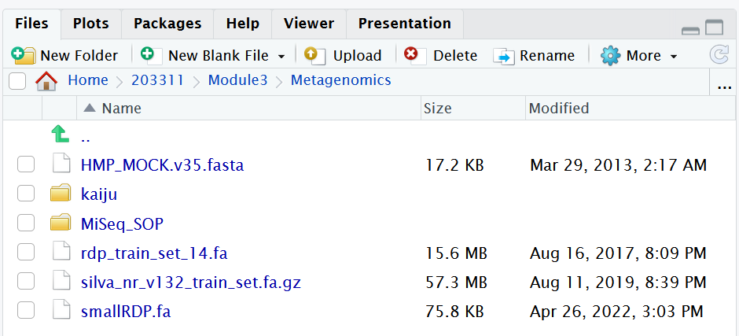<br>
Our reads to use.<br>


### Exercise 1: Observing the process of read analysis on the Kaiju webserver -- a.k.a. how it used to be

To illustrate how the process works on the webserver, the following is how you would upload a set of reads, and set up an analysis, **theoretically**.  I have performed all the potential combinations of databases and search algorithms for you, and we shall use these later in Exercise 2.

> **!! WARNING &#x26A0; !!
> Please read through this section carefully, go to the webserver, but do not upload any reads, we will do that ourselves in Exercise 2. Please make sure you can also answer Question 1 in this section, as it is key to the practical. Finally, please read the "Behind the Paper" feature, as you never know when you will need to be very familiar with its contents.**

So, we would use a pair of 500,000 paired Fastq sequences in two files – called _`sampleA_500k_R1.fq.gz`_ and _`sampleA_500k_R2.fq.gz`_ – and upload these to the Kaiju webserver and perform a taxonomic analysis on the reads.  These reads are found in the `kaiju` folder.  There are other files in there too, but more on those later.

These reads are environmental samples taken as part of a Massey University research project I was involved with a few years ago.  

Now let’s go to the website, and start the uploading process (**theoretically**):

1.  Go to <https://kaiju.binf.ku.dk/>

  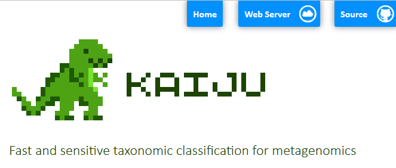

2.  Click on the webserver icon at the top of the page.

3.  You would enter your name for the job, and then your email address, so you will know when the job is complete by getting an email.

    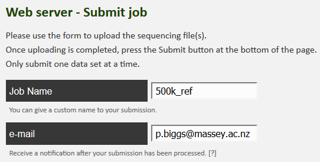


4.  Now we can upload the reads, one at a time. Select the “Select file” box, and it will open up a window for the first read.  Select _`sampleA_500k_R1.fq.gz`_ from the dialogue box and click on “Start upload”.  As soon as you have done this, click on “Upload a second file for paired end sequencing”.

    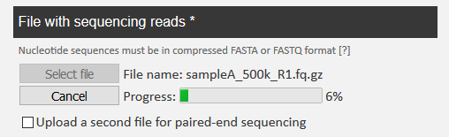


5.  In the same way, you can upload _`sampleA_500k_R2.fq.gz`_ as well.   Click on “Start upload” again.

    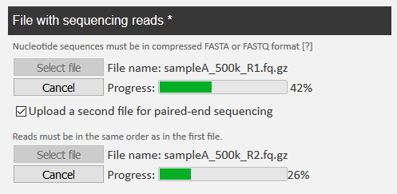


6.  When both reads are completely uploaded, you see the following.

    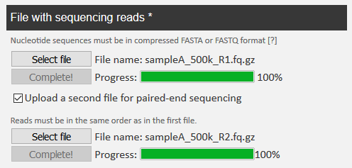


7.  Now you would choose the database for the job name, as in the table below, and you are ready to click on “Submit” at the bottom of the page.

**NB:** There would be a bit of waiting for this first part of the process, so I suggest whilst you are waiting, you read the “Behind the Paper” feature on the _Nature Microbiology_ website for the Kaiju publication.  The link is below:

<https://naturemicrobiologycommunity.nature.com/users/10226-peter-menzel/posts/6200-from-metagenomics-of-hot-springs-to-bioinformatics-software-development>

This is not super-long but gives you a chance to see the motivation for the paper from the authors, and is well worth a read.  

>**Question 1:**
>
> On looking at Kaiju webserver, on the left are listed the reference databases.  Have a look at the quick database descriptions and write down in the box below what you think might happen in terms of the potential results we might get back when our results are notified to us.
>
> <table><tr><th> </th></tr><tbody><tr><td> </td></tr><tr><td> </td></tr><tr><td> </td></tr></tbody></table>


### Exercise 2: Data uploading and generation -- the 2024 method

We are going to replicate this process on the command line, with two variations: the number of reads, and the database we are going to use.  so that this can be run within the time of lab practical we will use the "fungi" database and 50,000 reads.

We will go to the terminal, starting in our usual place - `tur-rstudio2`.

  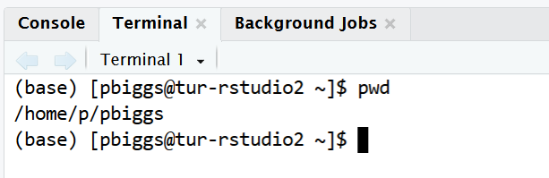<br>

Once you have done this, type the following:

```bash
## let's use a command called "ssh" to log on to another server

# This has a number "1" at the end of the server nazme, it is not the letter "l".
$ ssh tur-kaiju1

# Log in with your normal Windows password to gain access to "tur-kaiju1"

# You will see a request to trust the authenticity of the new server.
```

It will look something like:

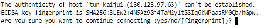<br>


Type **\[Yes\]** to accept.  You should now see the following:

  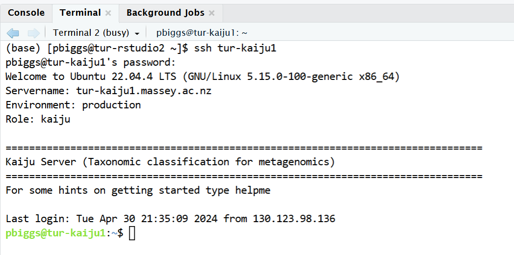<br>

Fantastic, we have moved ourselves to a new server!!  Now we can type `helpme` to see a nice introductory message.  Don't worry, we will go through this in detail shortly:

  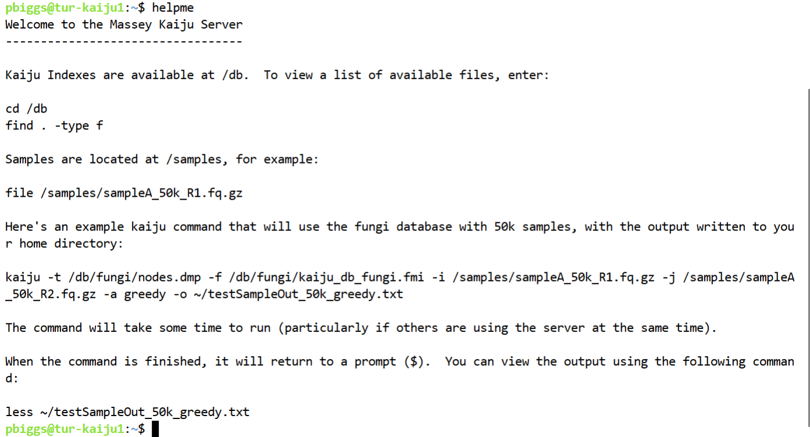<br>

Let's see the basic command for `kaiju`, and what it returns.  We will get an error initially as we have not declared any files, but that is OK for now.

```bash
## type "kaiju" in the "tur-kaiju1" terminal window, and we will see what is returned

$ kaiju
# Error: Please specify the location of the nodes.dmp file, using the -t option.

# Kaiju 1.9.2
# Copyright 2015-2022 Peter Menzel, Anders Krogh
# License GPLv3+: GNU GPL version 3 or later <http://gnu.org/licenses/gpl.html>

# Usage:
#   kaiju -t nodes.dmp -f kaiju_db.fmi -i reads.fastq [-j reads2.fastq]

#   Mandatory arguments:
#      -t FILENAME   Name of nodes.dmp file
#      -f FILENAME   Name of database (.fmi) file
#      -i FILENAME   Name of input file containing reads in FASTA or FASTQ format   
```

We need a minimum of 3 files to make this run:
- Two files for taxonomy which are the `-t` and `-f` options.
- We then need either a single read file by using the `-i` option, or as in our case the `-j` option for a second read file.

Things have been set up so that running this code requires relatively short path names - I have copied the reads over for you, and they are in the _`/samples/`_ folder, and all our taxonomy database files are in the _`/db/`_ folder.  For simplicity, we will run this in our home directory on `tur-kaiju1`.

We will generate a set of data each with the default _`greedy`_ algorithm, and then a second set with the  _`mem`_ algorithm.  Here is the code to type:

> **!! WARNING &#x26A0; !!
> This code is quite complex, please make sure it is correct, otherwise it will fail.**


```bash
# We also declare the `-a` option for the algorithm,
# and the `-o` option for the name of the output file.

## first default greedy (this is one line of code)
$ kaiju -t /db/fungi/nodes.dmp -f /db/fungi/kaiju_db_fungi.fmi
-i /samples/sampleA_50k_R1.fq.gz -j /samples/sampleA_50k_R2.fq.gz -a greedy
-o ~/fungi_50k_greedy.txt

## then mem (this is one line of code)
$ kaiju -t /db/fungi/nodes.dmp -f /db/fungi/kaiju_db_fungi.fmi
-i /samples/sampleA_50k_R1.fq.gz -j /samples/sampleA_50k_R2.fq.gz -a mem
-o ~/fungi_50k_mem.txt
```

These commands will take about 1.5 minutes each, and if the commands are queued, it might take a little longer.  However, it should complete just fine.  We will also execute a couple of extra lines of code to help us visualise what we have generated.  

```bash
## two extra commands to help us visualise our output
## I show the screen output as well.

## first default greedy
$ kaiju2krona -t /db/nr_euk/nodes.dmp -n /db/nr_euk/names.dmp -i ~/fungi_50k_greedy.txt -u -v -o ~/fungi_50k_greedy.txt.krona
# Reading taxonomic tree from file /db/nr_euk/nodes.dmp
# Reading taxon names from file /db/nr_euk/names.dmp
# Processing /home/p/pbiggs/fungi_50k_greedy.txt...
# Writing to file /home/p/pbiggs/fungi_50k_greedy.txt.krona

$ ktImportText -o ~/fungi_50k_greedy.txt.html ~/fungi_50k_greedy.txt.krona
# Writing /home/p/pbiggs/fungi_50k_greedy.txt.html...

## then mem
$ kaiju2krona -t /db/nr_euk/nodes.dmp -n /db/nr_euk/names.dmp -i ~/fungi_50k_mem.txt -u -v -o ~/fungi_50k_mem.txt.krona
# Reading taxonomic tree from file /db/nr_euk/nodes.dmp
# Reading taxon names from file /db/nr_euk/names.dmp
# Processing /home/p/pbiggs/fungi_50k_mem.txt...
# Writing to file /home/p/pbiggs/fungi_50k_mem.txt.krona

$ ktImportText -o ~/fungi_50k_mem.txt.html ~/fungi_50k_mem.txt.krona
# Writing /home/p/pbiggs/fungi_50k_mem.txt.html...
```

What exactly this code is doing will become apparent in Exercise 3, but we will leave exact details for today.

Our final piece of work is to copy our results back to `tur-rstudio2` and close our terminal for `tur-kaiju1`.  Let's check we have 6 output files by running `ls -l *fungi*`.  If you do not see 6 files, please let a demonstrator know.

Now to copy and exit the terminal.  We will also have to authenticate between servers when we do the `scp`:

```bash
## copy over:
# remember to change "pbiggs" in the below line to your studentID
$ scp fungi* pbiggs@tur-rstudio2:~/203311/Module3/Metagenomics/kaiju

# exit "tur-kaiju1", and it's back to "tur-studio2"
$ exit
# logout
# Connection to tur-kaiju1 closed.
# (base) [pbiggs@tur-rstudio2 ~]$
```

Again you will see the following in this process:

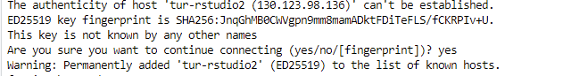<br>

So that's it, we are back to our usual `tur-rstudio2` server and you have run an example of _`kaiju`_ code on a different server, and copied the resulting data back.  Well done, that is no mean feat.

What's next after doing that?


### Exercise 3: Working with our data

As stated above, there are 6 sets of analyses that have been performed.  The information about these is provided in the table below:

<table>
<thead>
  <tr>
    <th>Database used:</th>
    <th>Run mode:</th>
    <th>Job name:</th>
  </tr>
</thead>
<tbody>
  <tr>
    <td>RefSeq Genomes</td>
    <td rowspan="3">Default (greedy)</td>
    <td>pjb_Gr500k_ref</td>
  </tr>
  <tr>
    <td>NCBI BLAST nr</td>
    <td>pjb_Gr500k_nr</td>
  </tr>
  <tr>
    <td>NCBI BLAST nr + euk</td>
    <td>pjb_Gr500k_nreuk</td>
  </tr>
  <tr>
    <td>RefSeq Genomes</td>
    <td rowspan="3">MEM</td>
    <td>pjb_MEM500k_ref</td>
  </tr>
  <tr>
    <td>NCBI BLAST nr</td>
    <td>pjb_MEM500k_nr</td>
  </tr>
  <tr>
    <td>NCBI BLAST nr + euk</td>
    <td>pjb_MEM500k_nreuk</td>
  </tr>
</tbody>
</table>

The output folder for these files is called _`resultsKaiju`_ and can be found within the _`~/203311/Module3/Metagenomics/`_ folder for Module3. There are 3 files per condition, and these files are:
1. those ending in _`.txt`_
2. those ending in _`.krona`_
3. those ending in _`.html`_

Let's start off with the `.txt.krona` files for an overview, and let's find out how many unclassified reads there are for our 6 datasets.  Remember, there are 500,000 paired Illumina reads that are being mapped against 3 databases with two algorithms.

```bash
# let's check where we are
$ pwd

# and move to the folder we need, presuming we are in 203311/Module3/Metagenomics/
$ cd resultsKaiju
$ grep "Unclassified" *.krona
```

>**Question 2:**
>
>Fill in the following table for your results to record the parameter values for the 3 results you have generated (any order of results is fine):
>
> <table><thead><tr><th>Job</th><th>A</th><th>B<br></th><th>C</th><th>D</th><th>E</th><th>F</th></tr></thead><tbody><tr><td>Job name</td><td></td><td></td><td></td><td></td><td></td><td></td></tr><tr><td>Reference database</td><td></td><td></td><td></td><td></td><td></td><td></td></tr><tr><td>Run mode</td><td></td><td></td><td></td><td></td><td></td><td></td></tr><tr><td>Number of classified reads</td><td></td><td></td><td></td><td></td><td></td><td></td></tr><tr><td>% classified</td><td></td><td></td><td></td><td></td><td></td><td></td></tr></tbody></table>

Wow, different combinations give different numbers of unmapped reads.  So we think, what is happening to our mapped reads?

We are going to have a look at one of the  _`.txt`_ files quickly as an example just to get a hint of what the output data looks like.  These are big files, so you will have to download them onto your local machine to do this (do you remember how to do this with the file manager window from within RStudio?).

Let's choose _`pjb_Gr500k_nreuk.txt`_ as an example.  

Open this file up in a spreadsheet program such as Excel.  Double click on the application to start it.  You will see the 7 columns as listed below:

1. either C or U, indicating whether the read is classified or unclassified.
2. name of the read
3. NCBI taxon identifier of the assigned taxon
4. the length or score of the best match used for classification
5. the taxon identifiers of all database sequences with the best match
6. the accession numbers of all database sequences with the best match
7. matching fragment sequence(s)


>**Question 3:**
>
>What is the name of the accession number for the sequence in column B called `M00933:6:000000000-A1D0H:1:1101:12995:3904`?
>
> <table><tr><td>
> ______________________________________________
> </td></tr></table>


### Exercise 4: Data analysis

We are interested in the file for the taxon path counts.  In a similar way, let’s open up the matching file to  _`pjb_Gr500k_nreuk.txt`_ which is called  _`pjb_Gr500k_nreuk.txt.krona`_ in a spreadsheet program like Excel to have a look at the contents.  This has far fewer rows of data as the hits to the same taxon have been merged.  You will have to sort the data on column A from largest to smallest for the next question.

>**Question 4:**
>
> - Using your spreadsheet for the _`pjb_Gr500k_nreuk.txt.krona`_ file (the results against the nreuk database), how many taxa are present at over 1000 counts?  
> - What is the number of counts we would use as a cutoff for 0.1%?  
> - How many taxa are there above this threshold?  
> - Finally, what is the species of bacteria with a count of 737?
>
> <table><tbody><tr><td>Over 1000 counts:</td><td></td></tr><tr><td>Counts for 0.1% cutoff:</td><td></td></tr><tr><td>Taxa present at more than 0.1%:</td><td></td></tr><tr><td>Taxon at count of 737:</td><td></td></tr></tbody></table>

### Exercise 5: Data comparisons

Part of the practical today is to look at similarities and differences between the databases, and what effect that can have on the results.  To do that, we need to have a file where all this data is listed together.  We will look at a file I have made to do this.  

As stated above, I have performed the same 3 analyses (against the same 3 databases), but with the "mem" algorithm specified rather than the default "greedy” algorithm.  I have then used a scripting language – Perl – and a database – MySQL – to process this data into a format where everything is all together based on the taxonomic classification.  You will find this file – _`500k_cutoffs.xlsx`_ – in the _`kaiju`_ folder for today’s practical.  Again, you will have to download the file again.

Open this file in Excel.  Immediately you will notice that there are actually 5 tabs here, where the data has been trimmed to remove any taxa that are present at fewer than 1, 10, 100, 1000 or 10000 counts.  These are unsurprisingly called _`Cutoff1, Cutoff10, Cutoff10, Cutoff1000`_ and _`Cutoff10000`_ respectively.

>**Question 5:**
>
>The original file - _`500k_cutoffs.xlsx`_ - has the taxon count numbers from 500,000 sequences that were classified by Kaiju.  We might be interested in focusing our analysis only on taxa that are present above a certain count, or above a certain percentage.  If we use count as a cutoff for including a taxon in the analysis, what percentage of total reads would the following specific counts correspond to?
>
> <table><thead><tr><th>cutoff</th><th>percentage</th><th>cutoff</th><th>percentage</th></tr></thead><tbody><tr><td>1</td><td></td><td>1000</td><td></td></tr><tr><td>10</td><td></td><td>10000</td><td></td></tr><tr><td>100</td><td></td><td></td><td></td></tr></tbody></table>

>**Question 6:**
>
>Now we turn to the Excel file, and its contents. How many taxa are represented for each of the 5 cutoff levels?
>
> <table><thead><tr><th>cutoff</th><th>number</th><th>cutoff</th><th>number</th></tr></thead><tbody><tr><td>1</td><td></td><td>1000</td><td></td></tr><tr><td>10</td><td></td><td>10000</td><td></td></tr><tr><td>100</td><td></td><td></td><td></td></tr></tbody></table>

Let’s investigate the data a little further.  Looking at the first tab - _`Cutoff10000`_ – does not show much, so we move on to the next one - _`Cutoff1000`_ – where we can start to see some differences in the counts.  Remember, this is the same underlying sequence dataset analysed in 6 different ways.  

>**Question 7:**
>
>How many taxa in the _`Cutoff1000`_ are eukaryotes (Hint: sort the data, or use find)?
>
> <table><tr><td>
> ______________________________________________
> </td></tr></table>

We have to go to the next two tabs - _`Cutoff100`_ and _`Cutoff10`_ – to really explore the data.  We will leave the last tab - _`Cutoff1`_ – for today, as there are too many taxa to deal with.  We shall look at _`Cutoff100`_ first.  Go to that tab now if you are not there.  

> **!! WARNING &#x26A0; !!
> Any sorting you are going to do shortly on the sheets needs to be across the columns A to I, otherwise things will go badly awry, and you will make incorrect inferences.  If that happens, download the file again, and start sorting again.**

The data are sorted by the descending average value (column G).  If we sort on the coefficient of variation (COV; column H), we are looking at the most equal counts.

>**Question 8:**
>
>What do you notice about the location of the “Unclassfied” taxa?
>
> <table><tr><td>
> ______________________________________________
> </td></tr></table>

Now sort _`Cutoff100`_ on column A.  Remember what databases you have been working with, and their constituents (from the Kaiju webpage).

>**Question 9:**
>
>When you compare columns A and D with columns B, C, E and F, what do you notice in the first 300 or so rows?  Why do you think this is?
>
> <table><tr><td>
> ______________________________________________
> </td></tr></table>

For our final look at the data, we will move to the _`Cutoff10`_ tab.  Sort this sheet on Taxonomy (column I) in the Z to A direction, i.e., making sure that "Unclassified" is at the top of the sheet.  Scroll down until you get to the Eukaryotes section of the taxonomy.  There are \~500 entries for the eukaryotes.

>**Question 10:**
>
>In column C, what is the eukaryote with the highest count?
> Why do you think there is a difference between columns C and F in terms of counts for a given taxon?
>
> <table><tbody><tr><td>Highest count:</td><td></td></tr><tr><td>Reason for differences in columns C and F:</td><td></td></tr></tbody></table>

Ok, so now we can look at visualising these data with Krona.


## Data visualisation with Krona

For this last part of this metagenomics portion, we will head back to our Kaiju data, and look at the Krona chart. Krona - <https://github.com/marbl/Krona/wiki> - is a way to explore hierarchical data with multi-layered pie charts in an interactive manner.  

We can do this inside the RStudio environment.  To do this, go to the _`kaiju`_ folder, and left click once the file _`pjb_Gr500k_nreuk.html`_. Then click on the “View in Web Browser” line.  This should open up a new webpage showing our results.  You should see something like the following:

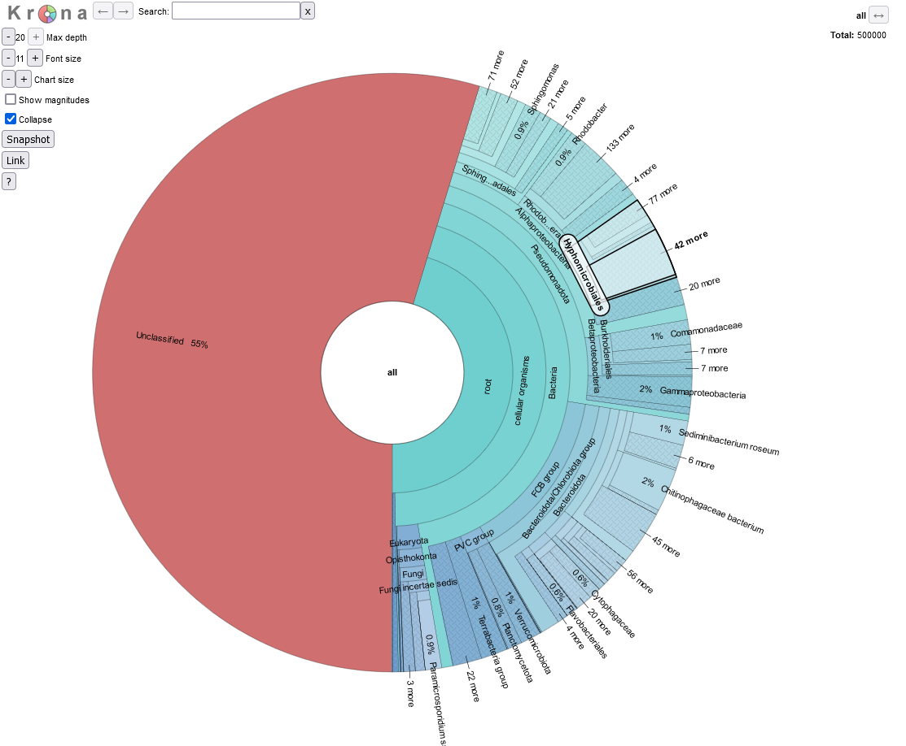<br>

We are going to explore the data as this is a fully interactive plot.  Let’s get rid of our unclassified data, as that is of no interest to us right now.  To do that, click on the area that says “root” so the segment goes grey, and then click again to get arrows, like in the picture below.

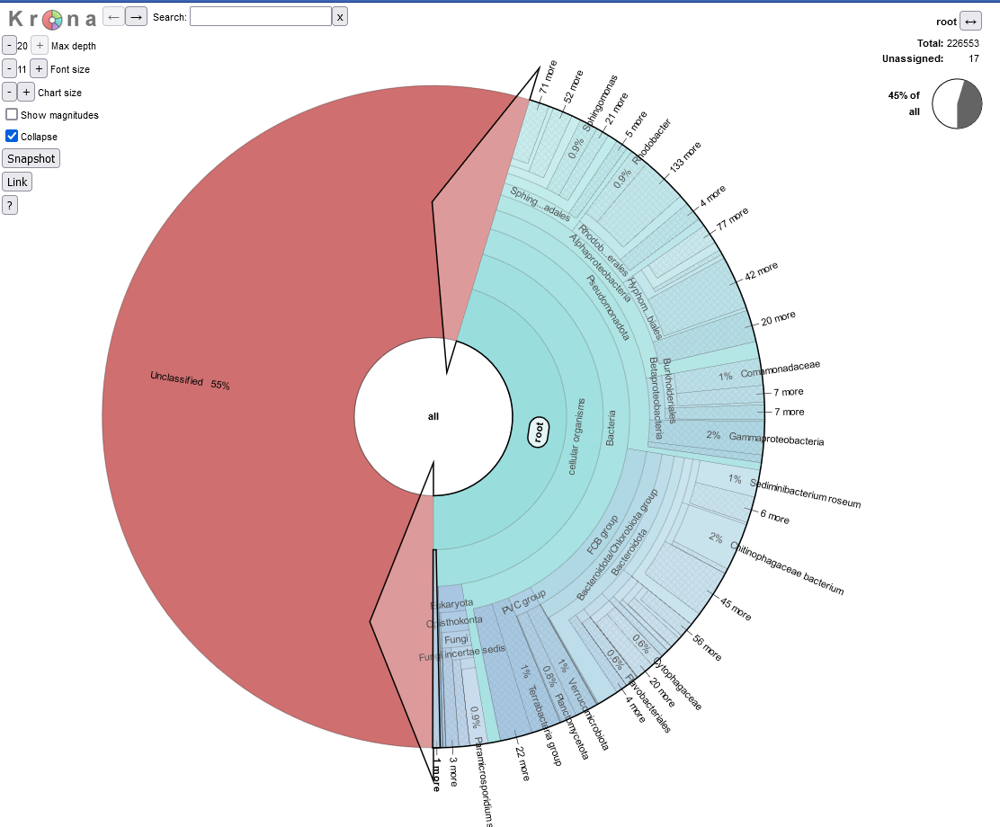<br>

If you now double click, the ‘unclassified’s disappear, and we now see our classified data.  The plot should have dramatically changed, and look something like the below:

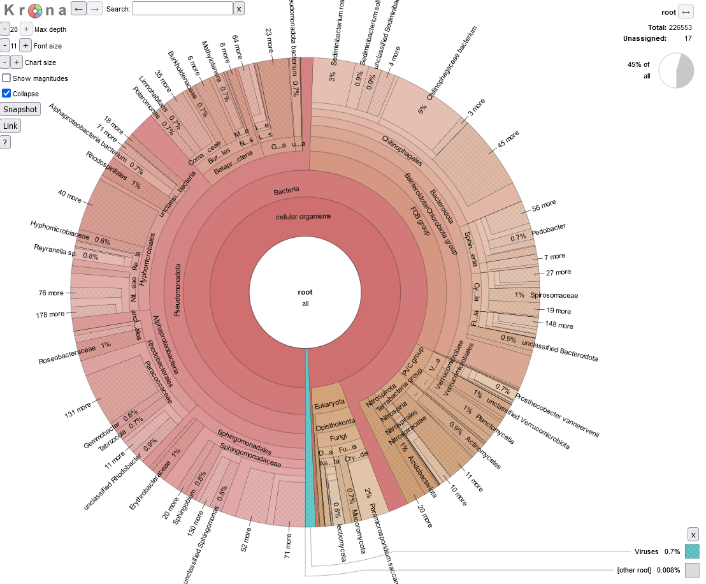<br>

We shall explore the viral world first.  Viruses make up 0.8% of this dataset.  Click on the blue section at the bottom to expand this section out.  When your arrow looks like the below, double click on it to generate the new view, as per the images below.

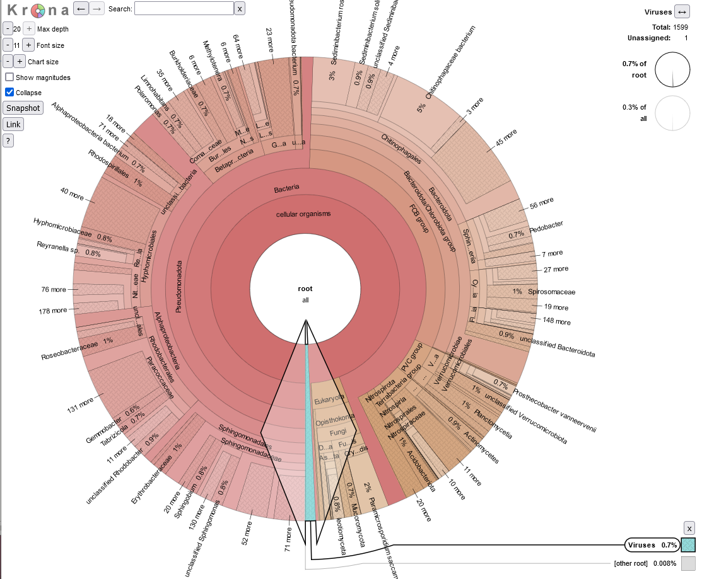<br>

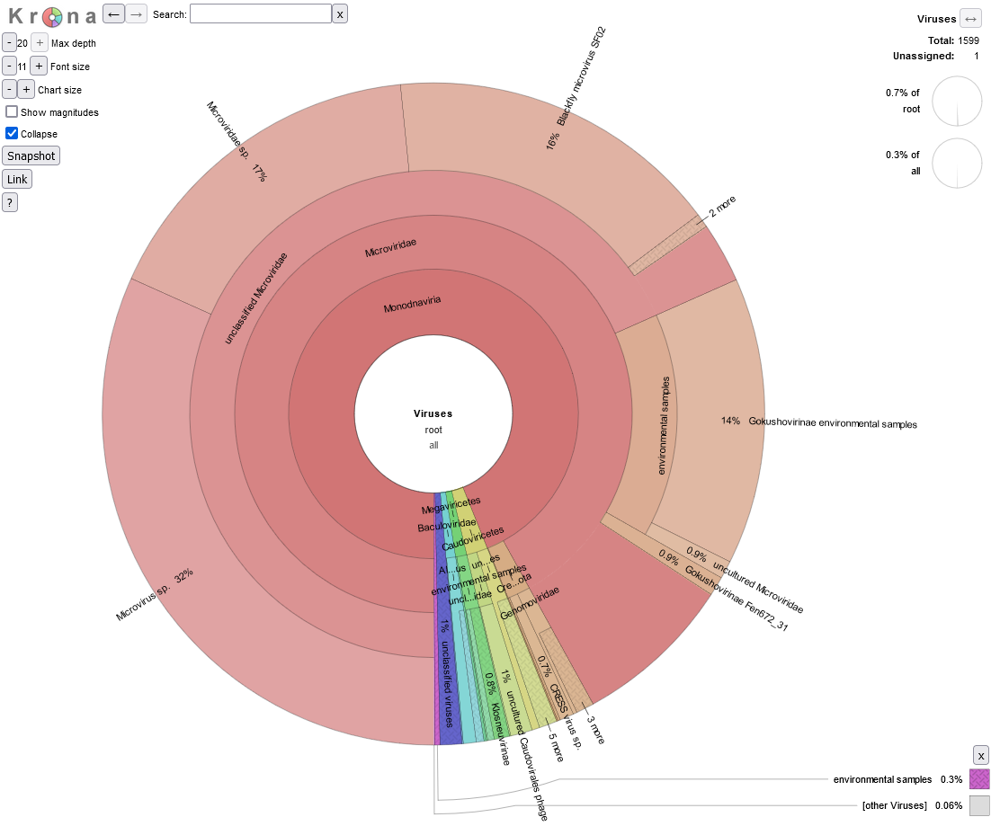<br>

>**Question 11:**
>
>How many viral sequences are there in this dataset (Hint: top right of the page)?  
>Given this value, approximately how many reads were assigned to Gokushovirinae Fen672_31?
>
> <table><tbody><tr><td>Number of viral reads:</td><td></td></tr><tr><td>Number of reads assigned to Gokushovirinae Fen672_31:</td><td></td></tr></tbody></table>

Have a click and explore the data for a couple of minutes.  Use the back arrow (top left of webpage) next to the word ‘Krona’ to go back out.  

<br>

Right, on to the microbial world.  

We can also search for taxonomic classifications across the bacterial tree of life.  Searching on a name shows where they are located in the plot.  For example, let’s find where _Gemmobacter_ is on the plot.  We can then double click to zoom in to the _Gemmobacter_ genus.  This is probably too close in, so if you click on say Paracoccaceae we can see what proportion of the Paracoccaceae are members of the _Gemmobacter_ genus.

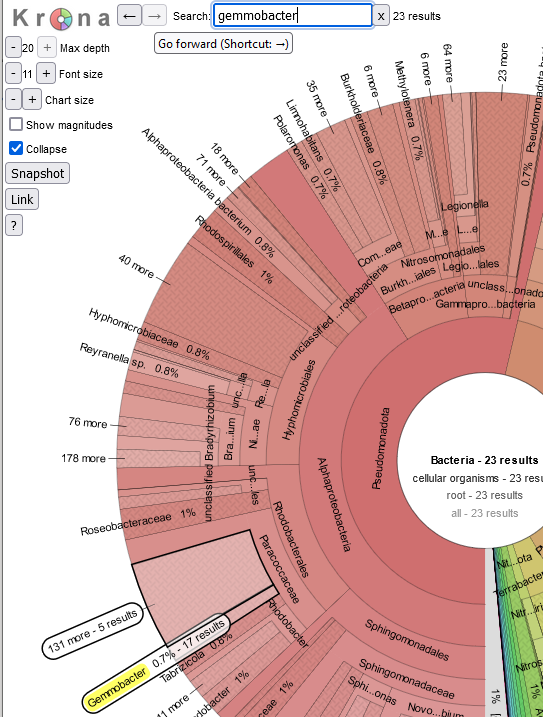


>**Question 12:**
>
>What approximate proportion of the Paracoccaceae family are members of the _Gemmobacter_ genus (Hint: adding up the percentages is fine for today)?
>
> <table><tr><td>
> ______________________________________________
> </td></tr></table>

A group of bacteria of interest – to me anyway! – are the Pseudomonadota, so as we did before, let’s click on that ring (found on the right side of the clock face) to show all the members of this taxonomic class.  Within the Pseudomonadota is the genus _Klebsiella_ (a human pathogen).  It's found within the Gammaproteobacteria.

>**Question 13:**
>
>Use the search function to find members of the _Klebsiella_ genus.  Can you use the rings of the plot to work out the full taxonomic path for the _Klebsiella_ genus?  Use a format like “Bacteria – Pseudomonadota - Gammaproteobacteria - XXXXX”.  The full taxonomic path is quite long.
>
> <table><tr><td>
> ______________________________________________
> </td></tr></table>

Within the Gammaproteobacteria is the order Legionellales (one member of which is responsible for Legionnaire’s disease).  This order is made up of two families – Legionellaceae and Coxillaceae – at different proportions, as well as a smaller proportion of unclassified Legionellales, but let's not worry about that.

>**Question 14:**
>
>Using the chart, and by clicking in various parts of the Krona image, what are the proportions of each of the two families?
>
> <table><tbody><tr><td>Legionellaceae:</td><td></td></tr><tr><td>Coxillaceae:</td><td></td></tr></tbody></table>

Finally, a quick check with our fungal data.  Let's open up _`fungi_50k_mem.txt.html`_ to see how different this looks.  It is the same process as before, clicking on the “View in Web Browser” line after having left-clicked on the file name.

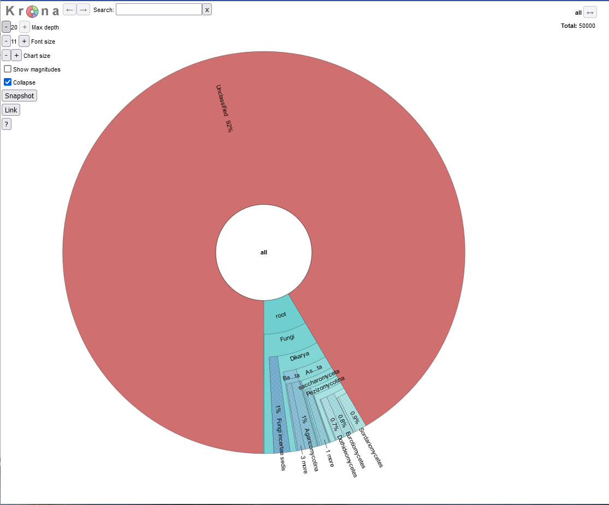<br>

Wow, different, huh?  There's so much unclassified data.  let's expand out the classified data as you have done previously

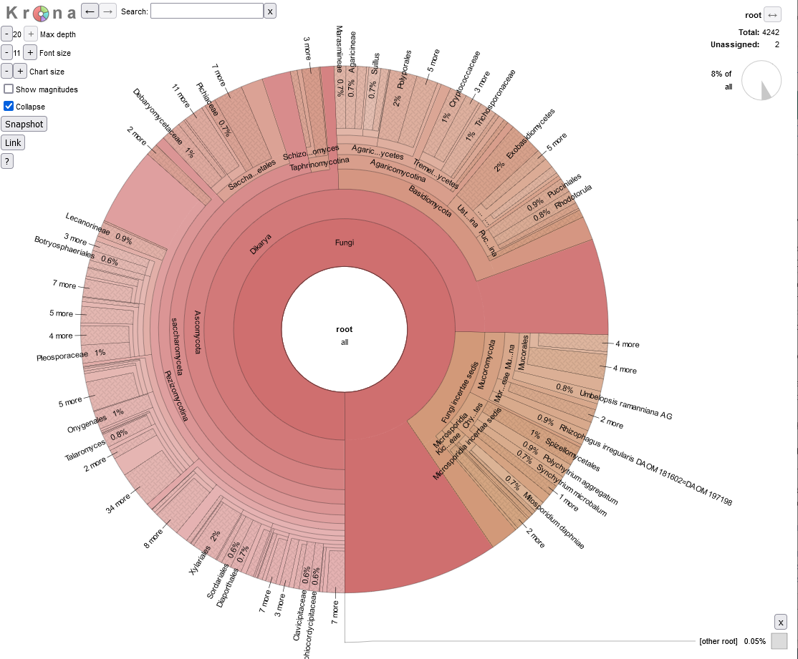<br>

>**Question 15:**
>
>Using the chart, what proportion of the data is classified?  Remember, for this we have only 50,0000 reads.  Finally, what are the read numbers for the Onygenales?
>
> <table><tbody><tr><td>proportion:</td><td></td></tr><tr><td>Onygenales:</td><td></td></tr></tbody></table>

---

## Further analysis of Kaiju output in R ##

### Locating data

We will now return to using `R` to look at our data, and head back to our RStudio Cloud environment.  The first thing we will need to do is to download our _`CutoffXXXX`_ files, i.e., our 5 different levels of counts from an external source this time.  These are now the file names, but with hyperlinks:  

- [500k_Cutoff1.txt](https://raw.githubusercontent.com/pjbiggs/Massey203311/main/Week9/files/500k_Cutoff1.txt "500k_Cutoff1.txt")
- [500k_Cutoff10.txt](https://raw.githubusercontent.com/pjbiggs/Massey203311/main/Week9/files/500k_Cutoff10.txt "500k_Cutoff10.txt")
- [500k_Cutoff100.txt](https://raw.githubusercontent.com/pjbiggs/Massey203311/main/Week9/files/500k_Cutoff100.txt "500k_Cutoff100.txt")
- [500k_Cutoff1000.txt](https://raw.githubusercontent.com/pjbiggs/Massey203311/main/Week9/files/500k_Cutoff1000.txt "500k_Cutoff1000.txt")
- [500k_Cutoff10000.txt](https://raw.githubusercontent.com/pjbiggs/Massey203311/main/Week9/files/500k_Cutoff10000.txt "500k_Cutoff10000.txt")

We will then repeat the process that was introduced in Week 4.  To download the data, first make sure you are in your _`~/203311/Module3/Metagenomics/`_ directory, and that you are using the Terminal tab in RStudio. Second, make a new directory called _`week9data`_, and change (`cd`) into that directory. Third, copy the link address (right click on the link and scroll to Copy Link Address). Finally, download the files using `wget`:

```bash
$ wget the_link_address_you_just_copied
```

>**Question 16:**
>
> What command line would you use to check the number of lines in your downloaded files using a wildcard character?
> how many lines are there in each of the 5 files?
>
> <table><thead><tr><th>code to run the command</th><th></th></tr></thead><tbody><tr><td>Cutoff1</td><td></td></tr><tr><td>Cutoff10</td><td></td></tr><tr><td>Cutoff100</td><td></td></tr><tr><td>Cutoff1000</td><td></td></tr><tr><td>Cutoff10000</td><td></td></tr></tbody></table>


### Basic dataset interaction

We have seen that the both the search algorithm (`MEM` or `Greedy`), as well as the database we are searching against (`Nr`, `NrEuk` or `RefOnly`) has implications for the composition of our single sample we are working with.  How can we visualise this?

#### Installing some new packages

**NB: these packages have to be installed by you to complete the Portfolio analysis.**

Please install the following packages, and then load them - and another one - for use.

```R
### install packages
> install.packages("UpSetR")
> install.packages("pheatmap")

### load packages
> library(UpSetR)
> library(pheatmap)
> library(data.table)
```

#### Loading data and subsetting on taxonomy

Let's load in some data now.  This presumes that you are at _`~/203311/Module3/Metagenomics/`_ and that you have made the  _`week9data`_ directory as stated above.  We will load in the _`500k_Cutoff1000.txt`_ file as an example, and perform some manipulation on it to allow us to work with the file in the rest of this section.

```R
### load in data
> cutDataFile <- read.table("week9data/500k_Cutoff1000.txt", header = TRUE, sep = "\t")

### remove unwanted columns
> cutDataFileRemovedCols <- subset(cutDataFile, select=-c(averVal, COV))

### remove the first row of unclassified data
> cutDataFileRemovedCols_noUC <- cutDataFileRemovedCols[-c(1), ]
```

The next thing is to make a subset based on a certain taxonomic classification.  Let's take "Proteobacteria" as a group.  You need to know the point in the taxonomy to get to "Proteobacteria", as this is therefore common also all taxonomic hits, and we can remove it to make the very long taxonomic names shorter.  So for "Proteobacteria", it is "root__cellular__organisms__Bacteria__Proteobacteria__", and this is want we want to remove, which we shall do thus:

```R
### make a new object on a certain taxonomic classification and below

## perform some column manipuluation to fix the taxonomy as our rowname
> rownames(cutDataFileRemovedCols_noUC) <- cutDataFileRemovedCols_noUC[,7]
> cutDataFileRemovedCols_noUC2 <- cutDataFileRemovedCols_noUC[,-7]

## extract out the rows of interest
> onlyTaxaOfInterest <- subset(cutDataFileRemovedCols_noUC2, rownames(cutDataFileRemovedCols_noUC2) %like% "Proteobacteria")

## tidy up the names
> rownames(onlyTaxaOfInterest) <- gsub("root__cellular__organisms__Bacteria__Proteobacteria__", "", rownames(onlyTaxaOfInterest))
```

This is why we are making a copy of the object here, so that you can look at _`cutDataFileRemovedCols_noUC2`_ to get the part of the name to remove.

>**Question 17:**
>
> How many rows does _`onlyTaxaOfInterest`_ have compared to  _`cutDataFileRemovedCols_noUC2`_? (Use one of the many methods you now are aware of, e.g. `grep` in the terminal, or by a manual inspection to find the numbers.)
>
> <table><tr><td>
> ____________________
> </td></tr></table>


### Visualising data in different ways

We are going to look at our data as heatmaps, and something called an UpSet plot.

#### Heatmaps

I talked about abundance of reads in the Week 9 lectures.  A convenient way to view the abundance of the different taxa is with a heatmap (such as at <https://r-graph-gallery.com/heatmap>).  Hopefully you are slightly familiar with these from the other Portfolio analyses that you have performed by now.

To draw a very basic heatmap, we use the `pheatmap()` command from the `pheatmap` package.  

```R
### draw a basic heatmap
> pheatmap(onlyTaxaOfInterest)
```
This command can be modified very extensively - have a look at `?pheatmap()` in the `R` console to get the help pages.  Try out a few things out if you like.

In window #4, this will look at little weird due to the long taxa names (which is why we have shortened them).  Click in the "Zoom" for the image to go to a new window.  As i have shown before, this window is stretchable, so you can make it look how you want, right click it and save it as an image.


#### UpSet plots

Now we are going to look at the data in a very different way.  This method is all to do with Venn diagrams, and thinking about the taxa results as members of sets.  In other words, overall if we get a taxon returned from a specific database, what other databases can we find that taxon in as well?  As we have 6 sets of data, we want to look at the insection of those 6.  How do we do that?  Here is an example of a Venn diagram with 6 intersecting sets:

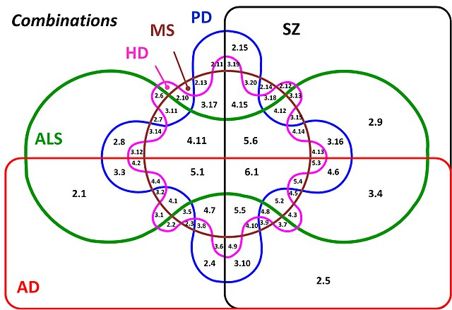<br>

What is going on here?  How intuitive is this?  The answer is **not very intuitive at all**.   Above 7 sets it is almost impossible to work out what is going on (it might be at 6 too!) with all the combination of relationships, and ever smaller parts of the figure where the intersections are found.  Therefore we are going to look at our data in a different way, using an UpSet plot.  You might have seen these on the R graph gallery (<https://r-graph-gallery.com/>) at <https://r-graph-gallery.com/upset-plot.html>.  Have a read of <https://upset.app/> for a brief introduction, an example plot and an explanation of what is going on here.  We are going to create a similar plot with our data.

To make the plot, we have to apply a transformation to our data to make it an absence/presence dataset and therefore lose our quantitative data.  So, in this case, any non-zero value in our dataset becomes 1, and 0 stays as 0.  Hence, if a taxon has 3 or 2048 counts associated with it, it gets transformed to 1.  This shows us relationships of the detected taxa, rather than the abundance.  This is still a useful way to look at the data to understand the relationship between the 6 datasets we have from our sample, rather than the abundance.  

```R
### remove unwanted columns
> cutDataFileUpSet <- subset(cutDataFile, select=-c(averVal, COV, taxonomy))

### convert all non-zero values to 1
> cutDataFileUpSet[cutDataFileUpSet != 0] <- 1

### add taxonomy back in
> cutDataFileUpSetTaxa <- cbind(cutDataFileUpSet, cutDataFile$taxonomy)
> colnames(cutDataFileUpSetTaxa)[7] <- "taxonomy"

### draw an upSet plot to show interactions
> setOrder = c("Greedy_Nr", "Greedy_NrEuk", "Greedy_RefOnly", "MEM_Nr", "MEM_NrEuk", "MEM_RefOnly")

> upset(cutDataFileUpSetTaxa, order.by = "freq", decreasing = TRUE,
+       sets = setOrder, keep.order = TRUE)
```

We have fixed the order of the sets here with the _`setOrder`_ object, have a go at changing the order of _`setOrder`_ if you want to change how the ouptut looks.

---


## Portfolio analysis

Once again, this is a two part analysis for the week 9 Portfolio analysis. This will result in a figure with a part A and a part B.  In the section above, the code and principles described are what you need for this Portfolio analysis.  You will have to apply them to the conditions and files listed in the sections below.  The code requirement, images and figure legends from this Week's analysis are as previously described.

#### Part A

In the "Visualising data in different ways" section above, for the "Heatmaps", we worked with an example file - _`500k_Cutoff1000.txt`_ - to understand and build the code to generate a heatmap that is readable in terms of numbers involved to easily visualise.  In this part, I would like you to choose one -- and only one -- of the following combinations to visualise how the taxonomic classification varies based on searching algorithm and database:

- combination 1: file _`500k_Cutoff10.txt`_ and taxonomic classification _`__Chitinophagia__`_
- combination 2: file _`500k_Cutoff1.txt`_ and taxonomic classification _`__Rhodobacter__`_
- combination 3: file _`500k_Cutoff1.txt`_ and taxonomic classification _`__Methanomicrobiales__`_

As with the code above, you are required to trim out the constant part of the taxonomic name to reduce the length of classification name.  Please use the exact search term above, otherwise you will get far longer taxomony names and your plot will look very complex.

#### Part B

In the "Visualising data in different ways" section above, for the "UpSet plots", we worked with an example file - _`500k_Cutoff1000.txt`_ - to understand the relationship between the databases, and how these overlap.  In this part, I would like you to choose one  -- and only one -- of the following files to visualise how the number of times a taxonomic result varies based on searching algorithm and database:

- file 1: file _`500k_Cutoff10.txt`_
- file 2: file _`500k_Cutoff1.txt`_


### Guiding thoughts for the portfolio

#### Part A

i) The command `pheatmap()` is one of the commands that have many options that you can use the modify the output.  Options that you might want to consider to modify its output include:

- `fontsize_row` -> change the font size of the rows i.e., the taxonomy names
- `filename` -> automatically print your image to a file, say a PDF or a PNG, but this might require a little checking in how your data will look
- `height` and `width` -> parameters to control the printing size (worth checking out the help material)

These and many more options are available via:

```R
> ?pheatmap
```

ii) In regards to the taxanomic classification, you are required to trim out the constant part of the taxonomic name to reduce the length of classification name for the purposes of plotting.  This requires a manual hunt in the text file you are working with to find the common parts of the taxonomy up to the names above, and then you can remove those also as above.  

iii) A random thought - if you have issues with viewing plots and you are writing output to files as well, please remember to run `dev.off()` potentially a number of times to reset plotting until you see:

```R
> dev.off()
null device
          1
```

#### Part B

i) There is not much to say here.  Plotting the data as it is is completely fine.  `upset()` is another command with many options to modify the output.  There is no option to print to a filename from within `upset()`, so that has to happen through other methods we have discussed already.

---

## Assessment

To reiterate, there is no direct assessment today. What is required however, is an understanding of the principles we have learnt today, as these will be required for the mastery test which accounts for 15% of the course. This will take place between Thursday 23-May-2024 and Friday 24-May-2024 online.

The mastery test will test the contents of weeks 8 to 10, more information will follow next week.


---

## Contact

I have two offices on the Manawatu campus (as I work for both SFTNS and SoVS), so I am not always in my Science Tower office D5-30. If you want to discuss anything, it's best to email me beforehand.

Prof Patrick Biggs,

Molecular Biosciences Group,

School of Natural Sciences

```
-. .-.   .-. .-.   .-. .-.   .
||\|||\ /|||\|||\ /|||\|||\ /|
|/ \|||\|||/ \|||\|||/ \|||\||
~   `-~ `-`   `-~ `-`   `-~ `-
```

<p.biggs@massey.ac.nz>


<!-- <br><br><br>

[GitHub Markdown cheat sheet](https://github.com/adam-p/markdown-here/wiki/Markdown-Cheatsheet)


This is how you put in an image file:
```

```
 -->
